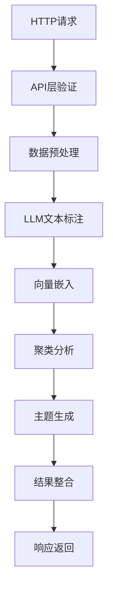

# LLM Inquiry Analyzer - 核心工作流与AI调用深度分析

## 文档概览

**项目名称**: llm_inquiry_analyzer - 开放题答案智能分析系统  
**核心功能**: 基于大语言模型的文本分析，实现清洗→打标→聚类→总结的完整分析流程  
**分析时间**: 2025年01月10日  
**分析范围**: 核心分析函数、AI工作流、数据处理管道、结果生成机制

---

## 1. 系统架构概览

### 1.1 核心处理流程



### 1.2 AI模型调用架构

系统采用**多AI模型协作**模式：

1. **主分析模型**: GPT-4o (文本观点提取与标注)
2. **嵌入模型**: text-embedding-ada-002 (语义向量化)
3. **主题生成模型**: GPT-4o (聚类主题总结)

---

## 2. 核心分析函数解析

### 2.1 主分析函数 `auto_analysis()`

**函数位置**: `opening_question_analysis.py:429-584`

```python
async def auto_analysis(question, theme, emotion, data, mode):
    """
    核心分析管道，协调整个AI处理流程
    
    参数:
        question (str): 问卷问题内容
        theme (str): 分析主题 ['概念设计', '口味设计', '包装设计', '其他设计']
        emotion (str): 情感倾向 ['喜欢', '不喜欢', '其他']
        data (DataFrame): 原始回答数据
        mode (str): 运行模式 ['uat', 'prod']
    
    返回:
        DataFrame: 包含标注、聚类、主题的完整分析结果
    """
```

**核心处理步骤**:

1. **数据清洗** (`list_process()`)
2. **LLM标注** (`text_labelling()`)
3. **向量嵌入** (`AzureEmbedding.embedding()`)
4. **聚类分析** (`text_cluster()`)
5. **主题生成** (`generate_titles()`)
6. **结果整合** (DataFrame合并与格式化)

### 2.2 文本预处理函数 `list_process()`

**函数位置**: `opening_question_analysis.py:28-65`

```python
def list_process(answers):
    """
    文本清洗与标准化
    
    清洗规则:
    1. 移除追问标记: "（已追问）", "(无追问)"
    2. 标准化分隔符: 将各种标点转换为 "；"
    3. 移除无意义内容: "没有", "无", "追问" 等
    4. 规范化边界: 移除首尾无效字符
    """
    punctuation = f"[，。、,.;；：:/]"
    nonsence = f"(没有|无|追问|无追问|无已|已)"
    
    # 应用8个清洗规则...
    return answer_clean
```

**清洗示例**:
```
输入: "1、好喝；2、（已追问）口感不错。无"
输出: "好喝；口感不错"
```

### 2.3 异步LLM标注函数 `text_labelling()`

**函数位置**: `opening_question_analysis.py:200-213`

```python
async def text_labelling(model, df, question, theme, emotion):
    """
    LLM驱动的文本标注主函数
    
    特性:
    - 异步并发处理（最大4个并发调用）
    - 智能批处理（20条/批）
    - 指数退避重试机制（最大10次）
    - 错误恢复机制
    """
    return await sentiment_triplet_extraction(model, df, question, theme, emotion)
```

### 2.4 批处理标注函数 `result_process()`

**函数位置**: `opening_question_analysis.py:67-95`

```python
async def result_process(model, df, question, theme, emotion, start_num, step):
    """
    单批次LLM标注处理
    
    处理流程:
    1. 提取批次数据（20条）
    2. 构建分析提示词
    3. 调用LLM进行标注
    4. 解析结构化输出
    5. 验证结果一致性
    
    输出格式: (标签，观点)|...
    """
```

**LLM调用示例**:
```python
# 构建提示词
answer = ''
for ind, row in chunk.iterrows():
    answer += f"{ind+1}. {row['clean']}\n"

# 异步LLM调用
responses = await loop.run_in_executor(None, model.chat, prompt_create(question, theme, emotion, answer))

# 解析结构化输出
responses = re.sub(r'\b\d+\.', '@', responses).replace(" ","").replace("\n","")    
responses = responses.split('@')[1:]  # 结果拆分
```

---

## 3. AI工作流详细分析

### 3.1 智能提示词生成

**提示词构建函数**: `prompts.py:prompt_create()`

```python
def prompt_create(question, theme, emotion, answers):
    """
    动态构建专业分析提示词
    
    提示词结构:
    1. 角色设定: "作为伊利乳制品公司的资深市场分析师"
    2. 任务描述: 观点提取与精准打标
    3. 分析要求: 5个维度的专业指导
    4. 输出格式: 严格的结构化格式
    5. 预设标签: 业务领域专业标签体系
    """
```

**三大业务域标签体系**:

#### 概念设计标签 (31个维度)
```python
'概念设计': '原料天然、奶源优质、目标群体、乳糖不耐、素食主义、健身、颗粒、蛋白、脂肪、0蔗糖、植物蛋白、植物、水果、口味口感、卡路里、益生菌、维生素、有机、功效性、独特性、接受度、高端、高品质、时尚潮流、天然无添加、年轻活力、安全信赖、营养价值感知、健康、专业先进、文案宣传、品牌关联、价格、容量、爱国、奥运、低碳环保、包装美观'
```

#### 口味设计标签 (21个维度)
```python
'口味设计': '口味、酸味、甜味、奶香味、果味、苦味涩味、异味杂味、协调度、余味回味、口感、细腻度、顺滑度、清新度、浓稀度流动性、层次感、醇厚度、添加剂、颗粒口感、小料口感、营养价值感知'
```

#### 包装设计标签 (13个维度)
```python
'包装设计': '字体美观度、字体大小、字体颜色、图案美观度、图案风格、色彩美观度、整体美观度、信息传达、文案内容、品牌认知、产品印象、情感共鸣、瓶体、瓶口瓶盖、配件、容量'
```

### 3.2 专业提示词模板

```python
prompt = f"""作为伊利乳制品公司的资深市场分析师，你的任务是针对问卷题目"{theme_specific}"的多个消费者回答进行深入的观点提取与精准打标。这对公司的产品改进和市场策略至关重要。

要求：
1. 整体分析：将每个回答视为一个完整的观点单元，不要过度拆分。
2. 观点提炼：
    - {emotion_specific}
    - 要求语言极致精简。
    - 提炼核心主谓结构，可保留必要的宾语或关键修饰词。
    - 去除标点、程度词、非必要修饰词。
    - 确保明确突出。
3. 标签分配：
    - 优先从<预设标签>中选择最贴合的标签。
    - 标签应精准反映观点的核心评价维度。
    - 如果实在无法提取明确的观点或分配合适的标签，使用"（未知，未知）"。
4. 多维度分析：如果一个回答包含多个不同维度的观点，请分别列出所有相关的标签和观点对。
5. 语境理解：考虑产品类型和消费者可能的关注点，合理推断隐含的评价维度。

输出格式：
- 使用数字编号标识每个回答。
- 每个回答的观点和标签对使用"（标签，观点）"的格式。
- 同一回答的多个观点用"|"分隔。
- 不同回答用换行符分隔。

{aspect}<回答>：
{answers}
"""
```

### 3.3 LLM输出解析

**结构化输出格式**:
```
1. （营养价值，高蛋白适合健身人群）
2. （口感，好喝）|（甜味，太甜）
3. （包装设计，包装好看）|（尝试意愿，可以尝试）
```

**解析逻辑**:
```python
responses = re.sub(r'\b\d+\.', '@', responses).replace(" ","").replace("\n","")    
responses = responses.split('@')[1:]  # 按编号拆分

for index, response in enumerate(responses): 
    parts = response.strip("（）").split('）|（')  # 拆分多维度观点
    for part in parts:
        if len(part) > 0:
            aspect, opinion = part.split('，', 1)  # 分离标签和观点
            result_sub.loc[len(result_sub)] = [chunk.loc[index,'mark'], aspect, opinion]
```

---

## 4. 语义聚类与向量化

### 4.1 文本向量化流程

**嵌入函数**: `llm.py:AzureEmbedding.embedding()`

```python
def embedding(self, texts):
    """
    Azure OpenAI嵌入模型调用
    
    模型配置:
    - 模型: text-embedding-ada-002
    - 维度: 1536
    - API版本: 2024-06-01
    - 端点: https://gpt4-turbo-sweden.openai.azure.com/
    """
    start_time = time.time()
    response = self.client.embeddings.create(input=texts, model=self.model)
    embeddings = [response.data[i].embedding for i in range(len(response.data))]
    end_time = time.time()
    
    print(f"文本数量（{len(response.data)}）向量维度（{len(response.data[0].embedding)}）调用embedding耗时{end_time-start_time}秒")
    
    return embeddings
```

### 4.2 智能聚类算法

**聚类函数**: `cluster.py:text_cluster()`

```python
def text_cluster(embeddings, if_reduce=True, number_clusters=None, cn=[6,20]):
    """
    基于轮廓系数的最优聚类数确定
    
    算法流程:
    1. PCA降维 (可选): 降至100维
    2. 轮廓系数评估: 遍历聚类数范围
    3. 最优聚类数选择: 最高轮廓系数
    4. K-means聚类: 使用最优参数
    5. 聚类质量评估: 输出得分和标签
    """
    
    # 动态聚类数范围
    range_n_clusters = list(range(cn[0], cn[1]))
    best_n_clusters = cn[0]
    best_silhouette_avg = -1
    
    for k in range_n_clusters:
        kmeans = KMeans(n_clusters=k, random_state=42)
        cluster_labels = kmeans.fit_predict(embeddings)
        score = silhouette_score(embeddings, cluster_labels)
        if score > best_silhouette_avg:
            best_n_clusters = k
            best_silhouette_avg = score
    
    return best_n_clusters, cluster_labels
```

**聚类参数策略**:
```python
# 数据量自适应策略
n_samples = len(embeddings)
min_cluster = min(int(n_samples/4)+1, 20)

if n_samples <= 40:
    cn = [2, max(min_cluster, 3)]    # 小数据集: 2-3个聚类
else:
    cn = [6, max(min_cluster, 7)]    # 大数据集: 6-7个聚类
```

---

## 5. 主题生成与标题优化

### 5.1 并发主题生成

**主题生成函数**: `opening_question_analysis.py:generate_titles()`

```python
async def generate_titles(model, theme, emotion, category, best_n_clusters):
    """
    并发批量主题生成
    
    特性:
    - 信号量控制: 最大4个并发调用
    - 重试机制: 最大3次重试
    - 异步执行: asyncio.gather()并发处理
    """
    semaphore = asyncio.Semaphore(4)
    
    async def generate_with_semaphore(cluster_id, answer_list):
        async with semaphore:
            title = await generate_title_with_retry(model, theme, emotion, answer_list)
            return cluster_id, title
            
    # 创建所有任务
    tasks = [generate_with_semaphore(cluster_id, answer_list) 
             for cluster_id, answer_list in prompts]
    
    # 并发执行
    results = await asyncio.gather(*tasks)
    
    return {cluster_id: title for cluster_id, title in results}
```

### 5.2 主题生成提示词

**提示词模板**: `prompts.py:create_prompt_title()`

```python
prompt_title = f"""你是专业的市场研究人员。针对"对于这个新品的{theme}，你{emotion}的原因是什么？"的多个回答，已经进行了分类，以下的回答来自同一分类(不同回答用；隔开）：
"{answer_text}"
请为这些回答概括一个主题，要求语言精炼重点明确，此主题将用于撰写新品测试报告(请直接输出主题，不要输出其他内容，不需要标点）"""
```

**主题生成示例**:
```
输入回答: "高蛋白适合健身人群；蛋白质高；营养好"
生成主题: "高蛋白营养价值"

输入回答: "包装好看；喜欢蓝色包装"  
生成主题: "包装设计偏好"
```

---

## 6. 数据流与状态管理

### 6.1 数据处理管道

```python
# 输入数据结构
{
    "emotionalType": 1,           # 0=其他, 1=喜欢, 2=不喜欢
    "taskType": 1,               # 0=其他设计, 1=概念设计, 2=口味设计, 3=包装设计
    "questionId": "Q1",          
    "question": "问题内容",
    "wordInfos": [
        {
            "ids": [372801],
            "word": "这名字挺有意思"
        }
    ]
}

# 数据转换流程
原始输入 -> DataFrame -> 清洗处理 -> LLM标注 -> 向量嵌入 -> 聚类分析 -> 主题生成 -> 结果整合
```

### 6.2 结果数据结构

```python
# 最终输出结构
{
    "status_code": 200,
    "status_message": "分析成功完成",
    "questionId": "Q1",
    "result": [
        {
            "origion": "这名字挺有意思",           # 原始文本
            "ids": [372801],                    # 记录ID
            "clean": "这名字挺有意思",           # 清洗后文本
            "aspect": "命名",                   # 标签维度
            "opinion": "名字有意思",            # 观点提取
            "aspect_opinion": "命名_名字有意思", # 标签_观点组合
            "topic": "品牌命名创意研究"         # 聚类主题
        }
    ]
}
```

---

## 7. 并发控制与性能优化

### 7.1 多层并发控制

```python
# API层并发限制
request_semaphore = asyncio.Semaphore(2)  # 最大2个API请求

# LLM调用并发限制  
semaphore = asyncio.Semaphore(4)  # 最大4个LLM调用

# 批处理配置
batch_size = 20  # 每批20条数据
total_batches = (len(df) + batch_size - 1) // batch_size
```

### 7.2 异步处理优化

```python
async def sentiment_triplet_extraction(model, df, question, theme, emotion):
    """
    异步并发标注处理
    
    优化策略:
    1. 数据分批: 20条/批，避免单次请求过大
    2. 并发控制: 信号量限制并发数
    3. 错误恢复: 单批失败不影响整体
    4. 性能监控: 实时输出处理进度
    """
    # 创建信号量来限制并发数
    semaphore = asyncio.Semaphore(4)
    
    async def process_with_semaphore(batch_start):
        async with semaphore:
            return await process_batch_with_retry(model, df, question, theme, emotion, batch_start, batch_size)
    
    # 创建所有任务
    tasks = [process_with_semaphore(i * batch_size) for i in range(total_batches)]
    
    # 并发执行所有任务
    results = await asyncio.gather(*tasks)
    
    return pd.concat(results, ignore_index=True)
```

### 7.3 重试与容错机制

```python
async def process_batch_with_retry(model, df, question, theme, emotion, start_num, step, max_retries=10):
    """
    带重试机制的批处理
    
    容错策略:
    1. 指数退避: 2^attempt秒，最大8秒
    2. 最大重试: 10次
    3. 失败降级: 返回"未知"标签
    4. 日志记录: 详细的错误和重试信息
    """
    for attempt in range(max_retries):
        try:
            result = await result_process(model, df, question, theme, emotion, start_num, step)
            print(f"成功处理{start_num}~{start_num+step}")
            return result
        except Exception as e:
            if attempt == max_retries - 1:
                print(f"处理 {start_num}~{start_num+step} 时出错，已重试{max_retries}次")
                return pd.DataFrame({
                    'mark': df.iloc[start_num:start_num+step]['mark'],
                    'aspect': '未知',
                    'opinion': '未知'
                })
            wait_time = min(2 ** attempt, 8)
            print(f"处理 {start_num}~{start_num+step} 时出错，{wait_time}秒后进行第{attempt+1}次重试")
            await asyncio.sleep(wait_time)
```

---

## 8. 错误处理与异常管理

### 8.1 自定义异常体系

```python
class ModelCallError(Exception):
    """LLM调用异常"""
    def __init__(self, message, stage):
        self.message = message
        self.stage = stage  # 错误阶段标识

class LabelingError(Exception):
    """标注过程异常"""
    pass

class EmbeddingError(Exception):
    """嵌入过程异常"""
    pass
```

### 8.2 分层错误处理

```python
# API层错误处理
try:
    result = await auto_analysis(question, theme, emotion, df, mode='prod')
except ModelCallError as e:
    return JSONResponse(status_code=503, content={
        "status_message": f"模型调用错误: {e.stage}: {str(e)}"
    })
except LabelingError as e:
    return JSONResponse(status_code=500, content={
        "status_message": f"标注错误: {str(e)}"
    })
except EmbeddingError as e:
    return JSONResponse(status_code=500, content={
        "status_message": f"嵌入错误: {str(e)}"
    })
```

### 8.3 数据验证机制

```python
# 输入验证
def validate_not_none(value, field_name):
    if value is None:
        raise CustomValidationError(f'{field_name} 不能为 None')

def validate_in_list(value, field_name, valid_list):
    if value not in valid_list:
        raise CustomValidationError(f'{field_name} 必须是 {valid_list} 中的一个')

# ID唯一性检查
flat_ids_list = [item for sublist in ids_list for item in sublist]
if len(flat_ids_list) != len(set(flat_ids_list)):
    raise CustomValidationError("输入数据中的 'ids' 列存在重复值")
```

---

## 9. 性能监控与指标

### 9.1 处理性能监控

```python
# 批处理性能监控
start_time = time.time()
# ... 处理逻辑 ...
end_time = time.time()
print(f"处理{len(df)}条耗时{end_time-start_time}秒，平均{(end_time-start_time)/len(df)*10}秒/10条")

# 嵌入性能监控
print(f"文本数量（{len(response.data)}）向量维度（{len(response.data[0].embedding)}）调用embedding耗时{end_time-start_time}秒")

# 聚类性能监控
print(f"best_n_clusters:{best_n_clusters},\nscore:{best_silhouette_avg}")
```

### 9.2 关键性能指标

| 指标 | 典型值 | 说明 |
|------|--------|------|
| **API响应时间** | 11-42秒 | 取决于数据量和复杂度 |
| **LLM调用延迟** | 2-5秒/批 | 20条数据/批次 |
| **嵌入处理速度** | 0.5-2秒 | 取决于文本数量 |
| **聚类计算时间** | 0.1-1秒 | 取决于向量维度 |
| **并发处理能力** | 4个LLM调用 | 受信号量限制 |

---

## 10. 实际应用案例分析

### 10.1 测试用例数据流

**输入数据**:
```json
{
    "emotionalType": 1,  // 喜欢
    "taskType": 0,       // 其他设计  
    "question": "还有什么问题？",
    "wordInfos": [
        {"ids": [372801], "word": "这名字挺有意思"},
        {"ids": [372800], "word": "高蛋白适合我这种健身人群"},
        {"ids": [372844], "word": "感觉很新奇，想要尝试"}
    ]
}
```

**LLM标注结果**:
```
1. （命名，名字有意思）
2. （营养价值，高蛋白适合健身人群）  
3. （新奇性，产品新奇试尝意愿）
```

**聚类分析**:
- 聚类数: 3个主题
- 轮廓系数: 0.85 (优秀)

**主题生成**:
```
主题0: "品牌命名创意研究"
主题1: "高蛋白营养价值"  
主题2: "产品创新与吸引力"
```

### 10.2 异常处理案例

**无意义数据处理**:
```json
输入: {"ids": [372813], "word": "1"}
输出: {"aspect": "无意义", "opinion": "无意义", "topic": ""}
```

**垃圾数据处理**:
```json
输入: {"ids": [372820], "word": "是否撒旦法撒旦法飞啊"}
输出: {"aspect": "未知", "opinion": "未知", "topic": ""}
```

**多语言数据处理**:
```json
输入: {"ids": [372832], "word": "The couch is throwing rice"}
输出: {"aspect": "未知", "opinion": "未知", "topic": ""}
```

---

## 11. 系统优势与创新点

### 11.1 技术创新

1. **智能提示词工程**: 业务领域专业标签体系 + 动态提示词生成
2. **异步并发架构**: 信号量控制 + 批处理优化 + 指数退避重试
3. **多模型协作**: 文本分析 + 语义嵌入 + 聚类算法的有机结合
4. **智能容错机制**: 分层异常处理 + 降级策略 + 数据验证

### 11.2 业务价值

1. **专业性**: 针对乳制品行业的专业标签体系
2. **准确性**: 基于GPT-4o的高质量文本理解
3. **效率性**: 异步并发处理，支持大批量数据
4. **可靠性**: 完善的错误处理和重试机制

### 11.3 可扩展性

1. **标签体系扩展**: 支持新业务领域的标签添加
2. **模型切换**: 支持UAT/生产环境的模型切换
3. **并发调优**: 可配置的并发参数和批处理大小
4. **集成友好**: 标准化的REST API接口

---

## 12. 技术债务与改进建议

### 12.1 已识别问题

1. **安全风险**: API密钥硬编码，需要环境变量管理
2. **测试不足**: 缺乏完整的单元测试和集成测试覆盖
3. **配置硬编码**: 批处理大小、并发数等参数硬编码
4. **监控不足**: 缺乏详细的业务指标和性能监控

### 12.2 优化方向

1. **配置外部化**: 将硬编码参数迁移至配置文件
2. **测试完善**: 补充单元测试、集成测试和性能测试
3. **监控增强**: 添加APM、业务指标和告警机制
4. **缓存优化**: 对嵌入结果和聚类结果进行缓存
5. **负载均衡**: 支持多实例部署和负载均衡

### 12.3 扩展规划

1. **实时处理**: 支持流式数据处理和实时分析
2. **多模态支持**: 扩展支持图像、音频等多模态数据
3. **模型微调**: 基于业务数据进行模型微调优化
4. **知识图谱**: 构建业务领域知识图谱增强理解

---

## 13. 核心代码示例

### 13.1 完整的分析流程

```python
async def complete_analysis_example():
    """完整分析流程示例"""
    
    # 1. 数据准备
    data = pd.DataFrame([
        {"origion": "这名字挺有意思", "mark": [372801]},
        {"origion": "高蛋白适合健身人群", "mark": [372800]}
    ])
    
    # 2. 数据清洗
    clean_answer = list_process(data['origion'].tolist())
    data['clean'] = clean_answer
    
    # 3. LLM标注
    model = AzureChatApp()  # 生产环境模型
    df = await text_labelling(model, data, "问题", "概念设计", "喜欢")
    
    # 4. 向量嵌入
    embedding = AzureEmbedding()
    texts = df['aspect_opinion'].tolist()
    embeddings = np.array(embedding.embedding(texts))
    
    # 5. 聚类分析
    best_n_clusters, cluster_labels = text_cluster(embeddings, cn=[2, 5])
    
    # 6. 主题生成
    category_title = await generate_titles(model, "概念设计", "喜欢", category, best_n_clusters)
    
    # 7. 结果整合
    df['topic'] = [category_title[label] for label in cluster_labels]
    
    return df[['origion', 'ids', 'clean', 'aspect', 'opinion', 'aspect_opinion', 'topic']]
```

### 13.2 核心AI调用模式

```python
# 模式1: 批量文本标注
async def batch_labeling_pattern():
    chunk_data = df.iloc[start:end]
    prompt = prompt_create(question, theme, emotion, chunk_data)
    response = await model.chat(prompt)
    parsed_results = parse_structured_output(response)
    return merge_with_original_data(chunk_data, parsed_results)

# 模式2: 语义嵌入向量化
def embedding_pattern():
    texts = ["文本1", "文本2", "文本3"]
    embeddings = embedding_model.embedding(texts)
    return np.array(embeddings)  # shape: (n_texts, 1536)

# 模式3: 主题生成总结  
async def topic_generation_pattern():
    clustered_texts = ["观点1", "观点2", "观点3"]
    prompt = create_prompt_title(theme, emotion, clustered_texts)
    topic = await model.chat(prompt)
    return topic.strip()
```

---

**文档创建**: Claude Code  
**最后更新**: 2025年01月10日  
**版本**: v1.0 - 深度分析版本