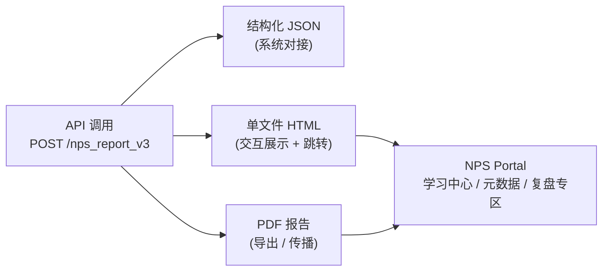

# NPS V3 报告设计说明书 (v2.1 增强版)

**作者**：产品设计负责人 / NPS 工具专家  
**版本**：v0.21 (增强版)  
**日期**：2025-09-23  

---

## 1. 背景与目标
(保持与第二版一致，此处略)  

---

## 8. 报告交付与传播路径

### 8.1 输出形式
- **JSON (系统对接)**  
- **HTML (单文件，自包含，带 Portal 跳转链接)**  
- **PDF (必选交付，方便导出与传播，保留 Portal 链接)**  

### 8.2 用户流转路径 (Mermaid 图示)

### 8.3 Portal 跳转逻辑
- **HTML 报告**：封面/页脚加按钮 → 学习中心、报告元数据、复盘专区。  
- **PDF 报告**：保留 Portal 链接，引导用户从传播回流到 Portal。  

---

## 9. 附录 (含内容摘要)
(同第二版，此处略)  

---

**结论**：  
v2.1 增强版在 v2 的基础上，补充了 **交付与传播路径示意图**，并通过 Mermaid 保证图中文本不再乱码。  
