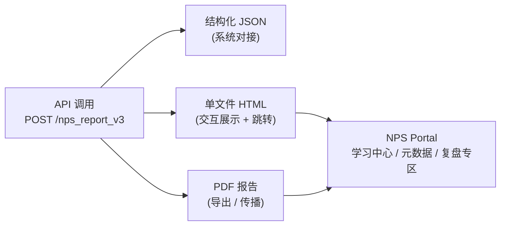

# NPS V3 报告设计说明书 (v2.1 增强版)

**作者**：产品设计负责人 / NPS 工具专家  
**版本**：v2.1 (增强版，含交付与传播路径示意图)  
**日期**：2025-09-23  

---

## 1. 背景与目标
(内容同第二版，略)

---

## 8. 推荐设计工作流

### 8.4 交付格式与传播路径

NPS V3 报告提供三种交付格式，并在 HTML / PDF 中引导用户回到 NPS Portal，形成“交付–传播–回流–复盘”的闭环：

- **JSON (系统对接)**  
- **HTML (交互展示 + Portal 跳转)**  
- **PDF (导出 / 传播)**  
- **Portal (学习中心 / 元数据 / 复盘专区)**  

### 示意图 (Mermaid)

---

## 9. 附录
(保持第二版的完整附录目录与内容引用)

---

**结论**：  
v2.1 增强版在第二版的基础上，增加了 **交付与传播路径示意图 (Mermaid)**，避免了跨平台阅读中中文字体乱码的问题，使架构和用户流转更直观、可靠。
