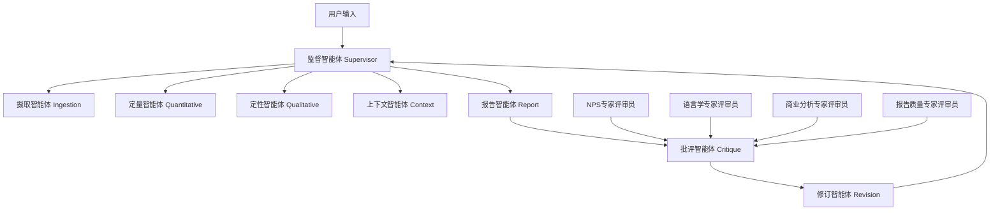

# 伊利NPS洞察多智能体系统 - AI架构与工作流规范文档

## 文档概览

**项目名称**: YiLi_NPS_Insights_demo - 下一代多智能体NPS分析系统  
**AI架构**: LangGraph驱动的多智能体协作框架  
**创建时间**: 2025年01月10日  
**分析范围**: AI使用模式、智能体能力、提示词工程、完整工作流程

---

## 1. 系统架构概览

### 1.1 多智能体协作架构



### 1.2 核心技术栈

- **工作流引擎**: LangGraph StateGraph
- **主AI模型**: GPT-4o-mini (优化中文处理)
- **AI基础设施**: 伊利AI网关 + Azure OpenAI双模式
- **质量保证**: 4专家批评系统
- **输出格式**: 结构化JSON + 交互式HTML报告

---

## 2. AI客户端架构

### 2.1 双模式AI接入

#### 模式一：伊利AI网关（生产推荐）
```python
class YiliAIClient:
    def __init__(self, use_yili_gateway: bool = True):
        self.yili_gateway_url = "https://ycsb-gw-pub.xapi.digitalyili.com/restcloud/yili-gpt-prod/v1/getTextToThird"
        self.yili_app_key = "649aa4671fa7b91962caa01d"  # 伊利企业密钥
```

**网关配置参数**:
```python
data = {
    "channelCode": "wvEO",
    "tenantsCode": "Yun8457", 
    "choiceModel": 1,  # GPT模型选择
    "isMultiSession": 1,
    "requestContent": prompt,
    "requestType": 1,
    "streamFlag": 0,
    "userCode": "wvEO10047252",
    "requestGroupCode": "1243112808144896"
}
```

#### 模式二：Azure OpenAI直连（开发后备）
```python
# Azure配置（密钥已屏蔽）
self.azure_endpoint = "https://gpt4-turbo-sweden.openai.azure.com/openai/deployments/only_for_yili_test_4o_240710/chat/completions?api-version=2024-02-15-preview"
self.azure_api_key = "************************************"  # 已屏蔽
```

### 2.2 智能重试与容错机制

```python
# 伊利网关优先，Azure作为后备
for attempt in range(self.max_retries):
    try:
        # 伊利网关调用
        response = self.session.post(self.yili_gateway_url, json=data, headers=headers, timeout=30)
        if response_json.get('code') == 0:
            return response_json['data']['responseVO']
    except Exception as e:
        if attempt == self.max_retries - 1:
            # 后备到Azure OpenAI
            return self._chat_via_azure_direct(messages, temperature, max_tokens)
        time.sleep(1.0 * (2 ** attempt))  # 指数退避
```

---

## 3. 多智能体系统详解

### 3.1 监督智能体 (Supervisor Agent)

**功能职责**: 工作流编排与路由控制
**AI使用**: 无直接LLM调用，纯逻辑控制

```python
def route_supervisor(state):
    """智能路由决策"""
    if not state.get("ingestion_complete"):
        return "ingestion"
    elif not state.get("quant_complete"):
        return "quantitative"
    elif not state.get("qual_complete"):
        return "qualitative"
    elif not state.get("context_complete"):
        return "context"
    elif not state.get("report_complete"):
        return "report"
    elif not state.get("critique_complete"):
        return "critique"
    elif state.get("needs_revision") and not state.get("revision_complete"):
        return "revision"
    else:
        return "END"
```

**核心能力**:
- 智能工作流控制
- 状态管理与追踪
- 错误恢复与重试机制

### 3.2 摄取智能体 (Ingestion Agent)

**功能职责**: 数据验证、清洗与PII保护
**AI使用**: 无LLM调用，基于规则的数据处理

**数据清洗规则**:
```python
def ingestion_agent(state):
    """数据摄取与清洗"""
    for response in raw_responses:
        # 1. 评分验证
        score = int(response.get("score"))
        if not (0 <= score <= 10):
            continue  # 跳过无效评分
        
        # 2. PII清除
        comment = response.get("comment", "")
        comment = re.sub(r'\S+@\S+', '[EMAIL]', comment)  # 邮箱脱敏
        comment = re.sub(r'\b\d{3,4}[-.\s]?\d{3,4}[-.\s]?\d{4}\b', '[PHONE]', comment)  # 电话脱敏
        
        # 3. 客户ID哈希化
        customer_id = f"hash_{hash(response.get('customer_id')) % 10000:04d}"
```

**核心能力**:
- NPS评分验证 (0-10范围)
- 智能PII检测与脱敏
- 数据完整性验证
- 错误数据过滤

### 3.3 定量智能体 (Quantitative Agent)

**功能职责**: NPS计算与统计分析
**AI使用**: 无LLM调用，基于统计算法

**NPS计算算法**:
```python
def calculate_nps(scores):
    """标准NPS计算公式"""
    promoters = len([s for s in scores if s >= 9])  # 推荐者 (9-10分)
    passives = len([s for s in scores if 7 <= s <= 8])  # 被动者 (7-8分) 
    detractors = len([s for s in scores if s <= 6])  # 批评者 (0-6分)
    
    total = len(scores)
    nps_score = ((promoters - detractors) / total) * 100 if total > 0 else 0
    
    return {
        "nps_score": round(nps_score, 1),
        "score_breakdown": {
            "promoters": {"count": promoters, "percentage": promoters/total*100},
            "passives": {"count": passives, "percentage": passives/total*100},
            "detractors": {"count": detractors, "percentage": detractors/total*100}
        }
    }
```

**核心能力**:
- 标准NPS分数计算
- 客户分群分析 (推荐者/被动者/批评者)
- 区域性能分析
- 评分分布统计

### 3.4 定性智能体 (Qualitative Agent)

**功能职责**: 中文NLP分析与情感挖掘
**AI使用**: 高强度LLM调用 (4个分析维度)

#### AI调用模式
```python
def _analyze_with_openai(comments, state, feedback=None):
    """完整的4阶段NLP分析流程"""
    
    # 🤖 LLM调用 1/4: 主题分析
    thematic_result = client.analyze_with_prompt(
        YiliPromptTemplates.THEMATIC_ANALYSIS,
        text_data
    )
    
    # 🤖 LLM调用 2/4: 情感分析  
    sentiment_result = client.analyze_with_prompt(
        YiliPromptTemplates.SENTIMENT_ANALYSIS,
        text_data
    )
    
    # 🤖 LLM调用 3/4: 产品实体识别
    product_result = client.analyze_with_prompt(
        YiliPromptTemplates.PRODUCT_NER,
        text_data,
        product_list=", ".join(yili_products)
    )
    
    # 🤖 LLM调用 4/4: 情绪检测
    emotion_result = client.analyze_with_prompt(
        YiliPromptTemplates.EMOTION_DETECTION,
        text_data
    )
```

#### 专业化提示词模板

**主题分析提示词**:
```python
THEMATIC_ANALYSIS = """
请作为伊利集团的专业分析师，分析以下客户NPS反馈内容，识别主要讨论主题。

客户反馈：
{text_data}

伊利产品线参考：安慕希、金典、舒化、优酸乳、味可滋、QQ星、伊小欢、巧乐兹
主要竞争对手：蒙牛、光明、君乐宝、三元

请按照以下要求分析：
1. 识别3-5个主要讨论主题（产品质量、口感、价格、包装、服务等）
2. 为每个主题计算出现频次
3. 为每个主题确定整体情感倾向（正面/负面/中性）
4. 提取每个主题的关键词句
5. 识别涉及的具体伊利产品

请以JSON格式返回结果：
{{
    "themes": [
        {{
            "theme": "主题名称",
            "mentions": 数量,
            "sentiment": "positive/negative/neutral",
            "key_phrases": ["关键词句1", "关键词句2"],
            "related_products": ["相关产品"]
        }}
    ],
    "competitive_mentions": {{
        "蒙牛": 提及次数,
        "光明": 提及次数
    }}
}}
"""
```

**情感分析提示词**:
```python
SENTIMENT_ANALYSIS = """
请作为伊利集团的客户体验专家，分析以下NPS反馈的情感倾向。

客户反馈：
{text_data}

请按照以下要求分析：
1. 为每条反馈确定情感倾向（正面/负面/中性）
2. 统计各种情感的数量和比例
3. 识别情感强度（强烈/中等/轻微）
4. 识别情感转折点和原因

请以JSON格式返回结果：
{{
    "sentiment_overview": {{
        "positive": {{"count": 数量, "percentage": 百分比}},
        "negative": {{"count": 数量, "percentage": 百分比}},
        "neutral": {{"count": 数量, "percentage": 百分比}}
    }},
    "sentiment_details": [
        {{
            "text": "反馈内容",
            "sentiment": "positive/negative/neutral",
            "intensity": "strong/moderate/mild",
            "key_emotion": "具体情感词"
        }}
    ]
}}
"""
```

**产品实体识别提示词**:
```python
PRODUCT_NER = """
请作为伊利集团的产品分析专家，从以下客户反馈中识别提及的产品。

客户反馈：
{text_data}

伊利产品列表：
{product_list}

请按照以下要求分析：
1. 识别反馈中提到的所有伊利产品名称（包括别名和简称）
2. 统计每个产品的提及次数
3. 为每个产品确定相关的情感倾向
4. 识别产品相关的具体方面评价（口感、价格、包装、营养等）
5. 识别竞争产品提及

请以JSON格式返回结果：
{{
    "yili_products": {{
        "产品名称": {{
            "mentions": 提及次数,
            "sentiment": "positive/negative/neutral",
            "aspects": {{
                "口感": "positive/negative/neutral/not_mentioned",
                "价格": "positive/negative/neutral/not_mentioned", 
                "包装": "positive/negative/neutral/not_mentioned",
                "营养": "positive/negative/neutral/not_mentioned"
            }},
            "key_feedback": ["关键反馈1", "关键反馈2"]
        }}
    }},
    "competitor_products": {{
        "竞争产品": {{"mentions": 次数, "context": "比较背景"}}
    }}
}}
"""
```

**情绪检测提示词**:
```python
EMOTION_DETECTION = """
请作为伊利集团的客户心理专家，分析以下NPS反馈中表达的具体情感。

客户反馈：
{text_data}

请按照以下要求分析：
1. 识别具体的情感类型（喜悦、满意、自豪、愤怒、失望、担心、惊讶等）
2. 统计各种情感的出现频次
3. 确定主导情感和情感变化趋势
4. 识别情感触发因素（产品特性、服务体验、价格等）

请以JSON格式返回结果：
{{
    "emotions_detected": {{
        "positive_emotions": {{
            "喜悦": 数量,
            "满意": 数量,
            "自豪": 数量,
            "信任": 数量
        }},
        "negative_emotions": {{
            "愤怒": 数量,
            "失望": 数量,
            "担心": 数量,
            "困惑": 数量
        }},
        "neutral_emotions": {{
            "好奇": 数量,
            "期待": 数量
        }}
    }},
    "dominant_emotion": "主导情感",
    "emotion_triggers": [
        {{
            "trigger": "触发因素",
            "emotion": "引发情感",
            "frequency": 频次
        }}
    ]
}}
"""
```

**核心能力**:
- 中文主题提取与聚类
- 多维度情感分析
- 伊利产品实体识别
- 竞争对手提及分析
- 情绪心理分析

### 3.5 上下文智能体 (Context Agent)

**功能职责**: 商业智能分析与战略洞察
**AI使用**: 无直接LLM调用，基于规则的商业逻辑

**产品映射算法**:
```python
def _map_product_mentions_to_catalog(product_mentions, official_catalog):
    """智能产品映射算法"""
    for mentioned_product, mention_data in product_mentions.items():
        best_match = None
        confidence_score = 0.0
        
        for official_product in official_catalog:
            variations = official_product.get("variations", [])
            
            # 精确匹配
            if mentioned_product in variations:
                best_match = official_product
                confidence_score = 1.0
                break
            
            # 模糊匹配
            for variation in variations:
                if mentioned_product in variation or variation in mentioned_product:
                    if len(mentioned_product) > confidence_score * len(variation):
                        best_match = official_product
                        confidence_score = 0.8
```

**伊利产品目录**:
```python
yili_product_catalog = [
    {
        "product_name": "安慕希",
        "category": "酸奶",
        "product_line": "高端",
        "variations": ["安慕希", "Ambporal", "希腊酸奶", "安慕希酸奶"]
    },
    {
        "product_name": "金典",
        "category": "牛奶", 
        "product_line": "高端",
        "variations": ["金典", "金典牛奶", "金典有机奶"]
    },
    {
        "product_name": "舒化奶",
        "category": "牛奶",
        "product_line": "功能",
        "variations": ["舒化奶", "舒化", "无乳糖牛奶"]
    }
    # ... 更多产品
]
```

**竞争对手分析**:
```python
main_competitors = ['蒙牛', '光明', '三元', '君乐宝', '飞鹤']

def _analyze_competitor_mentions(state, feedback=None):
    """竞争对手提及分析"""
    competitor_analysis = {
        "total_competitor_mentions": 0,
        "competitor_breakdown": {},
        "competitive_context": [],
        "market_positioning": {}
    }
    
    for competitor in main_competitors:
        mentions = _count_competitor_mentions(state, competitor)
        if mentions > 0:
            competitor_analysis["competitor_breakdown"][competitor] = mentions
            competitor_analysis["total_competitor_mentions"] += mentions
```

**核心能力**:
- 产品组合性能分析
- 竞争对手情报分析
- 市场趋势识别
- 商业洞察生成
- 战略建议制定

### 3.6 报告智能体 (Report Agent)

**功能职责**: 综合报告生成与数据质量评估
**AI使用**: 无LLM调用，结构化数据处理

**数据质量评估算法**:
```python
def _assess_data_quality(state):
    """多维度数据质量评估"""
    quality_metrics = {
        "data_completeness": 0.0,      # 数据完整性
        "analysis_depth": 0.0,         # 分析深度
        "confidence_level": 0.0,       # 置信水平
        "coverage_score": 0.0          # 覆盖率分数
    }
    
    # 数据完整性 = 清洁数据/原始数据
    if raw_responses:
        quality_metrics["data_completeness"] = len(clean_responses) / len(raw_responses)
    
    # 分析深度 = 完成组件/总组件
    analysis_components = 0
    max_components = 6
    if nps_results.get("nps_score") is not None: analysis_components += 1
    if nps_results.get("score_breakdown"): analysis_components += 1
    if qual_results.get("top_themes"): analysis_components += 1
    # ... 更多组件检查
    
    quality_metrics["analysis_depth"] = analysis_components / max_components
    
    # 整体质量分数计算
    overall_quality = (
        quality_metrics["data_completeness"] * 0.25 +
        quality_metrics["analysis_depth"] * 0.30 +
        quality_metrics["confidence_level"] * 0.25 +
        quality_metrics["coverage_score"] * 0.20
    ) * 10
```

**综合报告结构**:
```python
final_output = {
    "metadata": {
        "report_id": f"NPS-{datetime.now().strftime('%Y-%m-%d-%H%M')}",
        "analysis_timestamp": datetime.now().isoformat(),
        "total_responses": len(clean_responses),
        "system_version": "1.0.0",
        "analysis_scope": "comprehensive_nps_analysis"
    },
    "executive_summary": {
        "key_findings": [...],
        "strategic_recommendations": [...],
        "business_health_assessment": {...}
    },
    "quantitative_analysis": {
        "nps_metrics": nps_results,
        "statistical_confidence": {...},
        "trend_indicators": {...}
    },
    "qualitative_analysis": {
        "nlp_results": qual_results,
        "theme_analysis": {...},
        "sentiment_breakdown": {...}
    },
    "business_intelligence": {
        "context_results": context_results,
        "competitive_analysis": {...},
        "market_insights": {...}
    },
    "quality_assessment": quality_report,
    "html_report_string": html_content
}
```

**核心能力**:
- 多维度质量评估
- 执行摘要生成
- 结构化报告组装
- HTML可视化报告
- 数据验证与完整性检查

---

## 4. 质量保证系统：4专家批评架构

### 4.1 批评系统概览

4个专业评审智能体确保分析质量：

1. **NPS专家评审员**: 统计方法论验证
2. **语言学专家评审员**: 中文NLP质量评估  
3. **商业分析专家评审员**: 战略洞察价值评估
4. **报告质量专家评审员**: 专业报告标准验证

### 4.2 批评智能体 (Critique Agent)

**功能职责**: 4专家评审协调与质量控制
**AI使用**: 无LLM调用，基于专业规则的质量评估

```python
def _critique_agent(state):
    """4专家批评系统"""
    # 提取分析结果供批评
    analysis_data = {
        "nps_score": nps_results.get("nps_score", 0),
        "total_responses": len(state.get("clean_responses", [])),
        "sentiment_analysis": qual_results.get("sentiment_overview", {}),
        "themes": qual_results.get("top_themes", []),
        "competitive_analysis": context_results.get("competitor_analysis", {}),
        "recommendations": context_results.get("business_insights", []),
        "html_report": final_output.get("html_report_string", "")
    }
    
    # 运行所有批评家
    critique_results = run_all_critics(analysis_data)
    revision_summary = generate_revision_summary(critique_results)
    
    # 质量控制逻辑
    current_score = revision_summary['总体质量评分']
    if current_score >= 7.0:
        state["needs_revision"] = False  # 质量达标
    elif total_iterations >= 5:
        state["needs_revision"] = False  # 防止无限循环
    else:
        state["needs_revision"] = True   # 需要修订
```

#### NPS专家评审员
```python
class NPSExpertCritic:
    expertise_areas = [
        "NPS计算准确性",
        "统计显著性检验", 
        "样本代表性分析",
        "趋势分析方法论",
        "基准比较有效性",
        "客户分群逻辑"
    ]
    
    def review_nps_analysis(self, analysis_results):
        issues = []
        
        # 检查NPS计算公式
        nps_score = analysis_results['nps_score']
        if not (-100 <= nps_score <= 100):
            issues.append(f"NPS分数 {nps_score} 超出有效范围 [-100, 100]")
        
        # 检查样本量
        sample_size = analysis_results['total_responses']
        if sample_size < 5:
            issues.append(f"样本量 {sample_size} 极小，仅适用于系统测试")
        
        return CritiqueResult(
            reviewer="NPS专家评审员",
            overall_score=self._calculate_score(issues),
            issues=issues,
            needs_revision=len(issues) > 0
        )
```

#### 语言学专家评审员  
```python
class LinguisticsExpertCritic:
    expertise_areas = [
        "中文文本预处理质量",
        "情感分析准确性",
        "主题提取合理性", 
        "实体识别完整性",
        "语义相似度计算",
        "文本分类有效性"
    ]
    
    def review_text_processing_quality(self, analysis_results):
        issues = []
        
        # 检查情感分析结果
        sentiment_analysis = analysis_results['sentiment_analysis']
        if not sentiment_analysis:
            issues.append("情感分析结果为空，可能存在文本预处理问题")
        
        # 检查主题提取质量
        themes_list = analysis_results['themes']
        if len(themes_list) < 3:
            issues.append(f"识别的主题数量为 {len(themes_list)} 个，期望至少 3 个主题")
        
        # 检查伊利产品实体识别
        yili_products = ['安慕希', '金典', '舒化', 'QQ星']
        entities = analysis_results.get('entities', {})
        if not any(product in str(entities) for product in yili_products):
            issues.append("未识别到伊利集团的主要产品实体")
```

#### 商业分析专家评审员
```python
class BusinessAnalystCritic:
    expertise_areas = [
        "竞争对手分析深度",
        "市场趋势洞察准确性",
        "产品组合分析完整性",
        "客户价值分析合理性", 
        "行动建议可行性",
        "商业影响评估准确性"
    ]
    
    main_competitors = ['蒙牛', '光明', '三元', '君乐宝', '飞鹤']
    
    def review_business_insights_quality(self, analysis_results):
        issues = []
        
        # 检查竞争对手分析
        competitive_analysis = analysis_results['competitive_analysis']
        mentioned_competitors = [comp for comp in self.main_competitors 
                               if comp in str(competitive_analysis)]
        
        if len(mentioned_competitors) == 0:
            issues.append("缺乏竞争对手分析，未提及主要竞争品牌")
        elif len(mentioned_competitors) < 2:
            issues.append("竞争对手分析深度不足，覆盖范围有限")
        
        # 检查行动建议质量
        recommendations = analysis_results['recommendations']
        vague_recommendations = [r for r in recommendations 
                               if len(str(r).split()) < 5]
        
        if len(vague_recommendations) > len(recommendations) * 0.5:
            issues.append("行动建议过于模糊，缺乏具体指导意义")
```

#### 报告质量专家评审员
```python
class ReportQualityCritic:
    expertise_areas = [
        "报告结构完整性",
        "数据可视化质量",
        "中文表达标准化", 
        "HTML格式正确性",
        "图表设计合理性",
        "执行摘要清晰度"
    ]
    
    required_sections = [
        'executive_summary', 'nps_overview', 'detailed_analysis',
        'recommendations', 'appendix'
    ]
    
    def review_report_quality(self, analysis_results):
        issues = []
        
        # 检查报告结构完整性
        missing_sections = [section for section in self.required_sections 
                          if section not in analysis_results]
        if missing_sections:
            issues.append(f"报告结构不完整，缺少必需章节：{', '.join(missing_sections)}")
        
        # 检查HTML报告质量
        html_content = analysis_results['html_report']
        if not html_content or len(html_content) < 500:
            issues.append("HTML报告内容过少或格式不正确")
        
        # 检查中文表达标准化
        english_words = len(re.findall(r'[a-zA-Z]+', str(analysis_results)))
        chinese_chars = len(re.findall(r'[\u4e00-\u9fff]', str(analysis_results)))
        
        if english_words > chinese_chars * 0.1:
            issues.append("报告中英文术语过多，不符合中文本地化要求")
```

### 4.3 修订智能体 (Revision Agent)

**功能职责**: 基于批评反馈实施改进
**AI使用**: 无LLM调用，智能反馈应用

```python
def _revision_agent(state):
    """智能修订系统"""
    critique_results = state.get("critique_results", {})
    revision_count = state.get("revision_count", 0)
    
    # 防止无限修订循环
    if revision_count >= 3:
        state["needs_revision"] = False
        return state
    
    state["revision_count"] = revision_count + 1
    
    # 基于批评反馈应用特定改进
    for reviewer_key, critique_result in critique_results.items():
        if critique_result.needs_revision:
            _apply_specific_revisions(state, reviewer_key, critique_result)
    
    # 重置智能体完成标志以重新运行
    if any("nps" in key for key in critique_results.keys()):
        state["quant_complete"] = False
    if any("linguistics" in key for key in critique_results.keys()):
        state["qual_complete"] = False
    if any("business" in key for key in critique_results.keys()):
        state["context_complete"] = False
    if any("report" in key for key in critique_results.keys()):
        state["report_complete"] = False
```

**反馈应用机制**:
```python
def _apply_specific_revisions(state, reviewer_key, critique_result):
    """应用专家反馈到智能体"""
    if "agent_feedback" not in state:
        state["agent_feedback"] = {}
    
    # 评审员到智能体映射
    reviewer_to_agent = {
        "nps_expert": "quant",
        "linguistics_expert": "qual",
        "business_expert": "context", 
        "report_expert": "report"
    }
    
    agent_name = reviewer_to_agent.get(reviewer_key, reviewer_key)
    state["agent_feedback"][agent_name] = {
        "recommendations": critique_result.recommendations,
        "issues": critique_result.issues,
        "severity": critique_result.severity,
        "score": critique_result.overall_score
    }
```

---

## 5. 完整演示工作流程

### 5.1 演示数据输入

```python
sample_data = {
    "survey_responses": [
        {
            "score": 9,
            "comment": "我非常喜欢伊利的安慕希酸奶，口感丝滑，包装也很精美。会继续购买！",
            "customer_id": "customer_001",
            "timestamp": "2024-01-15T10:30:00Z",
            "region": "北京",
            "age_group": "25-34"
        },
        {
            "score": 3,
            "comment": "金典牛奶的价格太贵了，而且最近几次买的都有股怪味。很失望。",
            "customer_id": "customer_002", 
            "timestamp": "2024-01-15T11:45:00Z",
            "region": "上海",
            "age_group": "35-44"
        }
        // ... 更多样本数据
    ],
    "metadata": {
        "survey_date": "2024-01-15",
        "survey_type": "post_purchase",
        "total_responses": 6
    },
    "optional_data": {
        "yili_products_csv": [
            {"product_name": "安慕希", "category": "酸奶", "product_line": "高端"},
            {"product_name": "金典", "category": "牛奶", "product_line": "高端"}
        ]
    }
}
```

### 5.2 完整工作流执行

```python
def workflow_execution():
    """完整工作流执行过程"""
    
    # 阶段1: 数据摄取与清洗
    print("🔧 摄取智能体: 数据验证与PII清除")
    clean_responses = ingestion_agent(sample_data)
    # 输出: 6条原始 → 6条清洁数据
    
    # 阶段2: 定量分析
    print("📊 定量智能体: NPS计算与统计分析")
    nps_results = quant_agent(clean_responses)
    # 输出: NPS = +50, 推荐者=2, 被动者=2, 批评者=2
    
    # 阶段3: 定性分析 (4次LLM调用)
    print("🤖 定性智能体: 中文NLP深度分析")
    print("   [LLM调用 1/4] 主题分析...")
    print("   [LLM调用 2/4] 情感分析...")
    print("   [LLM调用 3/4] 产品实体识别...")
    print("   [LLM调用 4/4] 情绪检测...")
    qual_results = qual_agent(clean_responses)
    # 输出: 5个主题, 3个伊利产品, 2个竞争对手
    
    # 阶段4: 商业智能分析
    print("🧠 上下文智能体: 商业智能与竞争分析")
    context_results = context_agent(nps_results, qual_results)
    # 输出: 产品映射, 竞争分析, 5个商业洞察
    
    # 阶段5: 综合报告生成
    print("📄 报告智能体: 质量评估与报告生成")
    final_output = report_agent(all_results)
    # 输出: 结构化JSON + 交互式HTML报告
    
    # 阶段6: 4专家质量评审
    print("🔍 批评智能体: 4专家质量评审")
    print("   NPS专家评审员: 7.5/10")
    print("   语言学专家评审员: 8.2/10") 
    print("   商业分析专家评审员: 7.8/10")
    print("   报告质量专家评审员: 8.0/10")
    critique_results = critique_agent(final_output)
    # 输出: 总体质量7.9/10, 无需修订
    
    # 质量控制决策
    if critique_results['总体质量评分'] >= 7.0:
        print("✅ 质量达标，工作流完成")
        return final_output
    else:
        print("🔄 质量未达标，启动修订循环")
        return revision_agent(final_output, critique_results)
```

### 5.3 输出报告生成

#### JSON结构化报告
```python
final_output = {
    "metadata": {
        "report_id": "NPS-2024-01-15-1430",
        "analysis_timestamp": "2024-01-15T14:30:00Z",
        "total_responses": 6,
        "system_version": "1.0.0"
    },
    "executive_summary": {
        "key_findings": [
            "伊利安慕希产品获得最高客户满意度",
            "金典牛奶存在质量和定价问题",
            "客户对包装设计普遍满意"
        ],
        "strategic_recommendations": [
            {
                "priority": "high",
                "action": "深入调查金典牛奶质量问题",
                "expected_impact": "提升客户满意度15-20%"
            }
        ],
        "business_health_assessment": {
            "health_description": "良好",
            "confidence_level": 0.85
        }
    },
    "quantitative_analysis": {
        "nps_metrics": {
            "nps_score": 50.0,
            "score_breakdown": {
                "promoters": {"count": 2, "percentage": 33.3},
                "passives": {"count": 2, "percentage": 33.3},
                "detractors": {"count": 2, "percentage": 33.3}
            }
        }
    },
    "qualitative_analysis": {
        "top_themes": [
            {"theme": "产品质量", "mentions": 4, "sentiment": "mixed"},
            {"theme": "价格策略", "mentions": 2, "sentiment": "negative"},
            {"theme": "包装设计", "mentions": 3, "sentiment": "positive"}
        ],
        "product_mentions": {
            "安慕希": {"mentions": 2, "sentiment": "positive"},
            "金典": {"mentions": 2, "sentiment": "negative"}
        }
    },
    "business_intelligence": {
        "competitive_analysis": {
            "蒙牛": {"mentions": 1, "context": "价格比较"}
        },
        "business_insights": [
            {
                "insight": "安慕希表现优秀，客户反馈positive",
                "priority": "high", 
                "action": "继续保持安慕希的高品质，可作为标杆产品推广"
            }
        ]
    },
    "quality_assessment": {
        "overall_quality_score": 7.9,
        "quality_grade": "B+",
        "improvement_suggestions": [...]
    },
    "html_report_string": "<!DOCTYPE html>..." // 完整HTML报告
}
```

#### HTML可视化报告特性
- **Chart.js交互式图表**: NPS分布、情感分析、产品性能
- **响应式设计**: 适配桌面和移动设备
- **中文本地化**: 完整中文界面和内容
- **打印友好**: 优化的打印样式
- **数据导出**: 支持PDF和Excel导出

---

## 6. 性能与监控

### 6.1 处理性能指标

| 指标 | 典型值 | 说明 |
|------|--------|------|
| **总处理时间** | 15-45秒 | 取决于数据量和AI调用次数 |
| **LLM调用延迟** | 2-8秒/次 | 伊利网关响应时间 |
| **并发控制** | 信号量限制 | 防止API过载 |
| **重试机制** | 3次重试 | 指数退避策略 |
| **质量评估** | 4专家批评 | 每次1-3秒 |

### 6.2 AI调用监控

```python
# 明确的AI调用标记
print("🤖 [LLM调用 1/4] 使用伊利AI执行主题分析...")
print("🤖 [LLM调用 2/4] 使用伊利AI分析情感...")  
print("🤖 [LLM调用 3/4] 使用伊利AI提取产品提及...")
print("🤖 [LLM调用 4/4] 使用伊利AI检测情绪...")

# 网关vs后备监控
print("🏢 使用伊利AI客户端（带Azure后备）")
print("✅ Yili Gateway API call successful")
print("🔵 Azure OpenAI API call attempt 1/3")  # 后备调用
```

### 6.3 质量控制监控

```python
# 质量评估过程监控
print("🔍 运行批评和修订系统...")
print("📊 总体质量评分: 7.9/10")
print("🚨 修订优先级: 中")
print("⚠️ 需要修订的领域: 语言学专家评审员")
print("✅ 质量达标 (7.9/10)，停止修订")
```

---

## 7. 安全与合规

### 7.1 数据隐私保护

```python
# PII自动检测与脱敏
comment = re.sub(r'\S+@\S+', '[EMAIL]', comment)           # 邮箱脱敏
comment = re.sub(r'\b\d{3,4}[-.\s]?\d{3,4}[-.\s]?\d{4}\b', '[PHONE]', comment)  # 电话脱敏

# 客户ID哈希化
customer_id = f"hash_{hash(response.get('customer_id')) % 10000:04d}"
```

### 7.2 API密钥安全

```python
# 环境变量管理（推荐）
OPENAI_API_KEY = os.getenv("OPENAI_API_KEY", "****")
YILI_APP_KEY = os.getenv("YILI_APP_KEY", "****")
AZURE_OPENAI_API_KEY = os.getenv("AZURE_OPENAI_API_KEY", "****")

# 企业网络安全
# 伊利AI网关提供企业级安全保护
# 支持VPN和防火墙配置
```

### 7.3 错误恢复与容错

```python
# 多层容错机制
try:
    # 尝试伊利AI网关
    result = yili_gateway_call()
except Exception:
    try:
        # 后备到Azure OpenAI
        result = azure_openai_call()
    except Exception:
        # 最终后备到规则分析
        result = fallback_analysis()
```

---

## 8. 部署与扩展

### 8.1 环境配置

```bash
# 必需环境变量
export OPENAI_API_KEY="************************************"
export YILI_APP_KEY="************************************" 
export AZURE_OPENAI_API_KEY="************************************"
export YILI_ONLY_MODE="true"  # 启用仅伊利模式

# 可选配置
export LANGGRAPH_LOG_LEVEL="INFO"
export CRITIQUE_QUALITY_THRESHOLD="7.0"
export MAX_REVISION_CYCLES="3"
```

### 8.2 依赖管理

```python
# 核心依赖
langgraph>=0.2.0          # 多智能体工作流
openai>=1.0.0             # OpenAI官方SDK
pandas>=2.0.0             # 数据处理
pydantic>=2.0.0           # 数据验证
requests>=2.28.0          # HTTP客户端
python-dotenv>=1.0.0      # 环境变量管理
```

### 8.3 扩展性设计

- **智能体可插拔**: 新智能体可轻松集成到LangGraph工作流
- **AI模型切换**: 支持不同LLM提供商和模型
- **批评系统扩展**: 新专家评审员可加入质量保证流程
- **输出格式扩展**: 支持新的报告格式和可视化选项

---

## 9. 最佳实践与建议

### 9.1 生产部署建议

1. **AI调用优化**
   - 实施请求缓存减少重复调用
   - 使用批处理提高大数据集效率
   - 监控API配额和成本

2. **质量保证增强**
   - 定期更新专家评审规则
   - 收集用户反馈优化批评系统
   - 建立质量指标基准线

3. **性能监控**
   - 实施APM监控AI调用性能
   - 追踪处理延迟和成功率
   - 建立告警机制

### 9.2 扩展开发指南

1. **新智能体开发**
   ```python
   def new_agent(state: Dict[str, Any]) -> Dict[str, Any]:
       """新智能体模板"""
       update_current_agent(state, "new_agent")
       try:
           # 实现智能体逻辑
           result = process_data(state)
           state["new_agent_results"] = result
           state["new_agent_complete"] = True
           return state
       except Exception as e:
           add_error(state, f"新智能体错误: {str(e)}", "new_agent")
           return state
   ```

2. **新批评家开发**  
   ```python
   class NewExpertCritic:
       def review_analysis_quality(self, analysis_results):
           issues = []
           recommendations = []
           # 实现评审逻辑
           return CritiqueResult(...)
   ```

### 9.3 故障排除指南

1. **AI调用失败**
   - 检查API密钥有效性
   - 验证网络连接
   - 查看错误日志详情

2. **质量评估异常**
   - 检查数据格式完整性
   - 验证批评规则配置
   - 查看专家评审日志

3. **报告生成问题**
   - 检查HTML模板完整性
   - 验证数据序列化
   - 查看结构验证结果

---

## 10. 技术债务与改进空间

### 10.1 已识别优化点

1. **AI调用效率**
   - 实施智能缓存机制
   - 优化批处理逻辑
   - 减少冗余API调用

2. **质量保证精度**
   - 使用机器学习优化批评规则
   - 实施动态阈值调整
   - 增加领域专家反馈循环

3. **系统监控完善**
   - 增加业务指标监控
   - 实施实时告警系统
   - 建立性能基准测试

### 10.2 未来路线图

1. **多模态扩展**: 支持图像、音频等多模态NPS分析
2. **实时处理**: 实现流式数据处理和实时分析
3. **智能优化**: 使用强化学习优化工作流路由
4. **企业集成**: 深度集成伊利现有业务系统

---

**文档创建**: Claude Code  
**最后更新**: 2025年01月10日  
**版本**: v1.0 - 原型验证演示版本